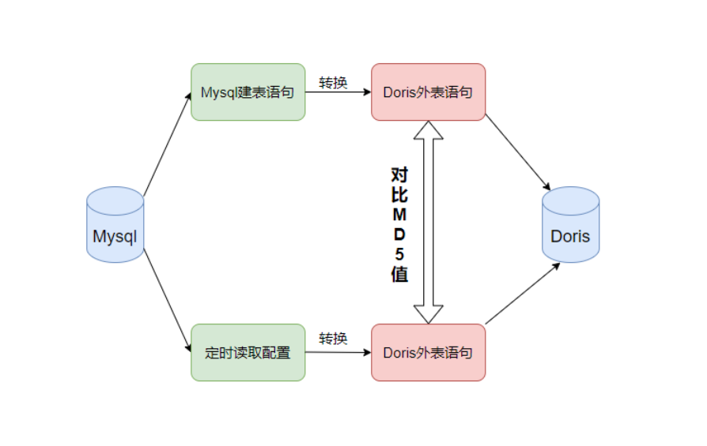

##Mysql_To_Rocks


###1、结构图



```shell
    mysql_to_rocks/
    ├── bin
    │   ├── e_auto.sh --外部表执行脚本
    │   └── e_mysql_to_rocks.sh --外部表建表语句生成脚本
    ├── conf
    │   ├── rocks.conf --外部表连接信息
    │   ├── rocks_tables --外部表库名.表名（自定义）
    │   ├── mysql.conf --外部表连接信息
    │   └── mysql_tables --源表库名.表名
    └── lib
        └── mysql_to_rocks.sh --mysql映射rocks外表结构转换
```


介绍：

首先用户需要配置conf目录下的4个配置文件分别是：

- rocks.conf：rocks的连接信息以及驱动名称和rocks的密码信息,用户默认为root
- mysql.conf：mysql的连接信息
- mysql_tables：需要被同步的mysql表名,格式为库名.表名
- rocks_tables：同步至rocks中的表名,需要用户自定义出表名称,格式同样为库名.表名
- 注意,mysql_tables和rocks_tables中的表配置需要一一对应

配置完配置文件后即可执行脚本生成外部表建表语句

```
sh e_mysql_to_rocks.sh
```

该脚本会将mysql的建表语句转换成rocks的建表语句,生成的语句会在上层目录的result中命名为e_mysql_to_rocks.sql


生成外部表建表语句后即可执行同步脚本,该脚本会运行上述文件,并且后续对用户的配置项和mysql表结构实施监控,即用户新增表或者是mysql的表结构发生了变更,该脚本会首先删除掉所有的rocks中的外表,然后重新创建建表语句并且执行它

```
nohup sh e_auto.sh &
```


